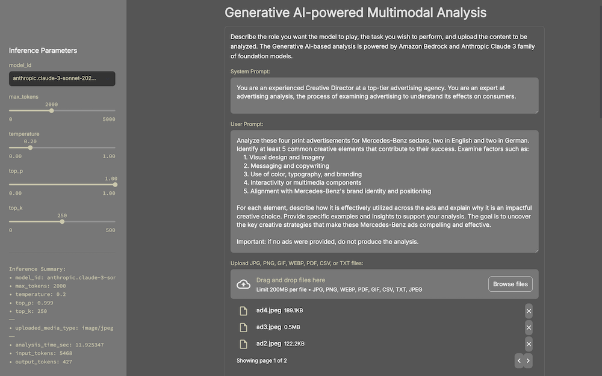
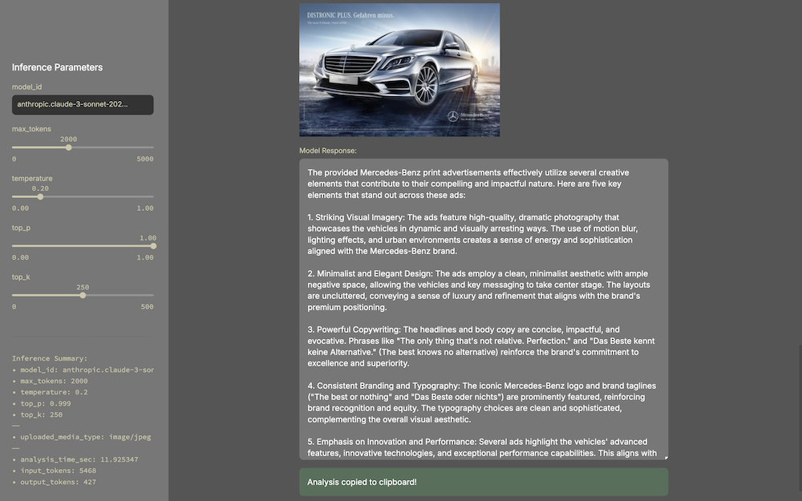
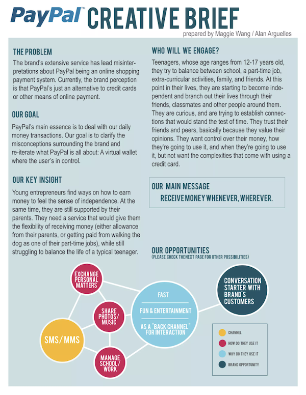

# Generative AI-powered Multimodal Analysis with Anthropic Claude 3

Streamlit [application](app.py) used for demonstrating [Anthropic Claude 3](https://www.anthropic.com/news/claude-3-family) family of multimodal models, Haiku, Sonnet, and Opus, on [Amazon Bedrock](https://aws.amazon.com/bedrock). The app was originally created for AdTech, MarTech, and Advertising Agencies that need to analyze advertising and generate new creative concepts. To start, describe the analysis task you wish to perform and optionally upload the content to be analyzed. The app currently supports uploading multiple JPG, PNG, GIF, WebP, PDF, CSV, or TXT files. The Streamlit application calls Amazon Bedrock's [Anthropic Claude Messages API](https://docs.aws.amazon.com/bedrock/latest/userguide/model-parameters-anthropic-claude-messages.html). Refer to this link for all inference parameters.

UI Preview:



Sample Response:



## Media Types Supported

Currently, this app supports the following media-types for uploading:

- image/jpeg - natively supported by Bedrock/Anthropic
- image/png - natively supported by Bedrock/Anthropic
- image/webp - natively supported by Bedrock/Anthropic
- image/gif - natively supported by Bedrock/Anthropic
- text/plain - content of file is added into prompt as raw text (uses StringIO)
- text/csv - content of file is added into prompt as raw text (uses StringIO - a bit hacky!)
- application/pdf - content of file is added into prompt as raw text (uses PyMuPDF - a bit hacky!)

## Start Application

Make sure you have provided your AWS credential on the commandline, or using an alternative authentication method, before starting the application.

```sh
export AWS_ACCESS_KEY_ID="<YOUR_AWS_ACCESS_KEY_ID>"
export AWS_SECRET_ACCESS_KEY="<YOUR_AWS_SECRET_ACCESS_KEY>"
export AWS_SESSION_TOKEN="<YOUR_AWS_SESSION_TOKEN>"
```

Create a virtual Python environment (1x):

```sh
python3 -m pip install virtualenv -Uq
virtualenv claude-streamlit-venv
python3 -m venv claude-streamlit-venv
source claude-streamlit-venv/bin/activate
```

Install Python package dependencies:

```sh
python3 -m pip install --upgrade pip
python3 -m pip install -r requirements.txt -Uq

streamlit --version
```

Run the Streamlit application:

```sh
streamlit run app.py \
    --server.runOnSave true \
    --theme.base "light" \
    --theme.backgroundColor "#333333" \
    --theme.primaryColor "#CCC8AA" \
    --theme.secondaryBackgroundColor "#777777" \
    --ui.hideTopBar "true" \
    --client.toolbarMode "minimal"
```

Deactivate and delete virtual environment once you are done:

```sh
deactivate
rm -r claude-streamlit-venv
```

## Samples Advertisements

<table>
    <tr>
        <td width=384><image src="mercedes_benz_ads/ad1.jpeg"></td>
        <td width=384><image src="mercedes_benz_ads/ad2.jpeg"></td>
    </tr>
    <tr>
        <td width=384><image src="mercedes_benz_ads/ad3.jpeg"></td>
        <td width=384><image src="mercedes_benz_ads/ad4.jpeg"></td>
    </tr>
</table>

## Samples Prompts

### 1a. Generate an Analysis of Print Advertisements for Mercedes-Benz

Provides an analysis of four public advertisements for Mercedes-Benz vehicles.

Upload (4) JPEGs:

- [ad1.jpeg](mercedes_benz_ads/ad1.jpeg)
- [ad2.jpeg](mercedes_benz_ads/ad2.jpeg)
- [ad3.jpeg](mercedes_benz_ads/ad3.jpeg)
- [ad4.jpeg](mercedes_benz_ads/ad4.jpeg)

Prompt:

System:

```text
You are an experienced Creative Director at a top-tier advertising agency. You are an expert at advertising analysis, the process of examining advertising to understand its effects on consumers.
```

User:

```text
Analyze these four print advertisements for Mercedes-Benz sedans, two in English and two in German. Identify at least 5 common creative elements that contribute to their success. Examine factors such as:
    1. Visual design and imagery
    2. Messaging and copywriting
    3. Use of color, typography, and branding
    4. Interactivity or multimedia components
    5. Alignment with Mercedes-Benz's brand identity and positioning

For each element, describe how it is effectively utilized across the ads and explain why it is an impactful creative choice. Provide specific examples and insights to support your analysis. The goal is to uncover the key creative strategies that make these Mercedes-Benz ads compelling and effective.

Important: if no ads were provided, do not produce the analysis.
```

### 1b. Generate an Analysis of Print Advertisements for Mercedes-Benz using Additional Information

Provides an analysis of four public advertisements for Mercedes-Benz vehicles using the Mercedes-Benz "Our design philosophy." website's content as reference for the analysis, which can be found in the [mercedes_benz_info.txt](mercedes_benz_ads/mercedes_benz_info.txt) file.

Upload (4) JPEGs:

- [ad1.jpeg](mercedes_benz_ads/ad1.jpeg)
- [ad2.jpeg](mercedes_benz_ads/ad2.jpeg)
- [ad3.jpeg](mercedes_benz_ads/ad3.jpeg)
- [ad4.jpeg](mercedes_benz_ads/ad4.jpeg)
- [Mercedes-Benz design philosophy](mercedes_benz_ads/mercedes_benz_info.txt)

System:

```text
Analyze these four successful print advertisements for Mercedes-Benz sedans, two in English and two in German. Identify common creative elements that contribute to their success. Explain how the elements align to Mercedes-Benz's design philosophy, described the mercedes_benz_info.txt file.
```

User:

```text
Analyze these four successful print advertisements for Mercedes-Benz sedans, two in English and two in German. Identify common creative elements that contribute to their success. Explain how the elements align to Mercedes-Benz's design philosophy, described below.

<design_philosophy>
{{ contents of mercedes_benz_info.txt }}
</design_philosophy>
```

### 2. Generate Better Prompts using Prompt Optimization

Improve the user's initial sub-optimal prompt using an Anthropic Claude 3 model. Same task as above, an analysis of four public advertisements for Mercedes-Benz vehicles.

Upload (4) JPEGs:

- [ad1.jpeg](mercedes_benz_ads/ad1.jpeg)
- [ad2.jpeg](mercedes_benz_ads/ad2.jpeg)
- [ad3.jpeg](mercedes_benz_ads/ad3.jpeg)
- [ad4.jpeg](mercedes_benz_ads/ad4.jpeg)

System:

```text
You are an expert at optimizing the performance of prompts for Anthropic Claude 3 large language models. Your job is to create concise and effective prompts that will ensure effective responses from a large language model.
```

User:

```text
Provide an effective prompt to complete the following marketing analyst's task involving the accompany advertising samples:

<task>
Analyze these print advertisements and find some common creative elements. Some ads are in English and some are in German.
</task>
```

### 3. Generate New Creative Concepts from Analysis of Print Advertisements for Mercedes-Benz

Using the resulting Mercedes-Benz advertising analysis to design a new 'Large Leaderboard' size digital advertisement appearing on the 'Modern Luxury | Manhattan' website for Mercedes-Benz C-Class Sedans, targeting young affluent urban couples between 25-35 years old.

Upload (2) PDFs:

- [Ad_Specs_Modern_Luxury.pdf](manhattan_ad_specs/Ad_Specs_Modern_Luxury.pdf)
- [Advertise_Info_Modern_Luxury.pdf](manhattan_ad_specs/Advertise_Info_Modern_Luxury.pdf)
- [Merceded-Benz Ads Analysis](mercedes_benz_ads/mercedes_benz_ads_analysis.txt)

System:

```text
You are an experienced Creative Director at a top-tier advertising agency. You are an expert at advertising analysis, the process of examining advertising to understand its effects on consumers.
```

User:

```text
Based on the following analysis of four successful Mercedes-Benz print advertisements, describe a new and compelling design for a 'Large Leaderboard' size digital advertisement appearing on the 'Modern Luxury | Manhattan' website, for Mercedes-Benz C-Class Sedans, targeting young affluent urban couples between 25-35 years old. Use the online ad specs as a reference for the layout, described in this PDF.

<analysis>
{{ Mercedes-Benz advertising analysis contents }}
</analysis>
```

### 4a. Summarize the Contents of a Text File

Upload (1) TXT file:

- [mercedes_benz_info.txt](mercedes_benz_ads/mercedes_benz_info.txt)

Prompt:

```text
Provides a concise summary of this document.
```

### 4b. Query Data in CSV File - Results will be Inaccurate

Most foundation models are not good at math. In this simple example, they cannot correctly add up a series of numbers. The model will provide a confident answer, but that answer is most likely not correct. This prompt writes a program that can correctly calculate the answer.

Source of dataset: [https://www.kaggle.com/datasets/yasserh/advertising-sales-dataset](https://www.kaggle.com/datasets/yasserh/advertising-sales-dataset)

Upload (1) CSV file:

- [Advertising_Budget_and_Sales.csv](/csv_data/Advertising_Budget_and_Sales.csv)

Prompts:

System:

```text
You are an experienced software developer, with a deep understanding of the different programming language and their libraries. You have significant experience in building complex applications that incorporate object-oriented programming, functional programming, data structures, and algorithms. You understand software design principles, best practices, and code optimization techniques. You regularly solve complex problems efficiently using your software development skills.
```

User:

```text
Based on the Advertising Budget and Sales CSV file, write a Python program to calculate the total sales. Use the Pandas package.
```

User:

```text
Based on the Advertising Budget and Sales CSV file, write a Java program to calculate the total sales.
```

User:

```text
Based on the Advertising Budget and Sales CSV file, write a Node.js program to calculate the grand total of all TV, radio, and newspaper ad budgets. Use the csv-parser package.
```

User:

```text
Based on the Advertising Budget and Sales CSV file, write a Python program to calculate the ratio of the grand total of TV, radio, and newspaper ad budgets to sales for ID 100. Use the Pandas package.
```

### 5. Generate New Creative Concepts Based on Analysis of a Creative Brief

Analyze a creative brief for PayPal and generate three ideas for new ads. Output a structured response as well-formatted JSON that an be easily ingested into a downstream system.

Upload (1) WebP file:

- [paypal-creative-brief-1-2048.webp](/paypal_creative_brief/paypal-creative-brief-1-2048.webp)

System:

```text
You are an experienced Creative Director at a top-tier advertising agency. You are an expert at advertising analysis, the process of examining advertising to understand its effects on consumers.
```

User:

```text
Based on the following Creative Brief for PayPal, develop three compelling online digital advertisements. In your response, include a unique ad ID (UUID), headline, ad copy, call to action, and description of imagery for each. The ad copy should be 20 words or less.
Format the response as a series of JSON objects according to the template below.

{
    "advertisements": [
        {
            "id": "",
            "headline": "",
            "ad_copy": "",
            "call_to_action": "",
            "imagery": ""
        },
        {
            "id": "",
            "headline": "",
            "ad_copy": "",
            "call_to_action": "",
            "imagery": ""
        },
        {
            "id": "",
            "headline": "",
            "ad_copy": "",
            "call_to_action": "",
            "imagery": ""
        }
    ]
}
```

Example Output:

```json
{
  "advertisements": [
    {
      "id": "ad-001-7b3c-4d2a-9f8e-1a2b3c4d5e6f",
      "headline": "Your Money, Your Way",
      "ad_copy": "Juggling school, work, and life? PayPal lets you receive money anytime, anywhere. Stay in control.",
      "call_to_action": "Sign Up Now",
      "imagery": "Split-screen image: one side shows a teenager studying, the other side shows the same teen receiving money on their smartphone."
    },
    {
      "id": "ad-002-9e8d-4c2b-a1f7-2b3c4d5e6f7g",
      "headline": "Independence Starts Here",
      "ad_copy": "From allowance to part-time gigs, manage your money easily with PayPal. No credit card needed.",
      "call_to_action": "Get Started",
      "imagery": "Animated GIF showing a teen's PayPal balance increasing as they complete various tasks like walking a dog or tutoring."
    },
    {
      "id": "ad-003-5a7f-4b6e-c3d2-3c4d5e6f7g8h",
      "headline": "Friends, Fun, Finances",
      "ad_copy": "Split costs, share expenses, and manage your money. PayPal: your social wallet for the digital age.",
      "call_to_action": "Join PayPal",
      "imagery": "Collage of teens enjoying activities together, with PayPal interface overlays showing easy money transfers between friends."
    }
  ]
}
```

### 6a. Generate a Layout Design for an Ad Based on Generated Creative Concepts

As a Graphic Designer, describe the layout of the advertisement, based on the content generated in example 5, above.

Upload (1) WebP file:

- [paypal-creative-brief-1-2048.webp](/paypal_creative_brief/paypal-creative-brief-1-2048.webp)



System:

```text
You are a talented Graphic Designer at a top-tier advertising agency. You are experienced at developing effective advertising layout for multiple media types: print, mobile, and web.
```

User:

```text
Based on the following headline, ad copy, call to action, and description of imagery, describe the design for a compelling online digital advertisement. The advertisement should be designed in a tall, portrait format, with a width of 300 pixels and a height of 600 pixels. The Creative Brief for PayPal is included for reference.

{
    "id": "3e67f83a-5f3e-4b4f-8653-b1c3c6b7147e",
    "headline": "Your Money, Your Control",
    "ad_copy": "Take charge of your finances with PayPal. No complexities, just convenience.",
    "call_to_action": "Download the App",
    "imagery": "The ad depicts a teenager's hand holding a smartphone with the PayPal app open, showcasing the ease of managing money on the go."
}
```

### 6b. Generate a Layout Design with Midjourney for an Ad Based on Generated Creative Concepts

As a Graphic Designer, describe the layout of the advertisement, based on the content generated in example 5, above.

Upload (1) WebP file:

- [paypal-creative-brief-1-2048.webp](/paypal_creative_brief/paypal-creative-brief-1-2048.webp)

System:

```text
You are a talented Graphic Designer at a top-tier advertising agency. You are experienced at developing effective advertising layout for multiple media types: print, mobile, and web.
```

User:

```text
Based on the following headline, ad copy, call to action, and description of imagery, describe the design for a compelling online digital advertisement. The advertisement should be designed in a tall, portrait format, with a width of 300 pixels and a height of 600 pixels (1:2 tall format). The Creative Brief for PayPal is included for reference.

{
    "id": "3e67f83a-5f3e-4b4f-8653-b1c3c6b7147e",
    "headline": "Your Money, Your Control",
    "ad_copy": "Take charge of your finances with PayPal. No complexities, just convenience.",
    "call_to_action": "Download the App",
    "imagery": "The ad depicts a teenager's hand holding a smartphone with the PayPal app open, showcasing the ease of managing money on the go."
}

Write the response in a format that will be an effective prompt for generating an image of the advertisement with Midjourney. Important, include the flags '--ar 1:2 --q 2 --v 6.1' at the end of the response.
```

Example Output:

```text
A compelling online digital advertisement for PayPal in a 300x600 pixel portrait format: 1. Background: Use a gradient background transitioning from PayPal's signature blue at the top to a light, fresh teal at the bottom. This creates a modern, youthful feel that appeals to the target audience of teenagers. 2. Header: At the top of the ad, place the PayPal logo in white, making it stand out against the blue background. 3. Main Image: In the center of the ad, feature a close-up of a teenager's hand holding a smartphone. The phone should display the PayPal app interface, showcasing its clean, user-friendly design. This image should take up about 40% of the ad space. 4. Headline: Above the main image, place the headline "Your Money, Your Control" in bold, white text. Use a modern, sans-serif font that appeals to younger audiences. 5. Ad Copy: Below the main image, include the ad copy "Take charge of your finances with PayPal. No complexities, just convenience." in smaller, easy-to-read white text. 6. Call-to-Action: At the bottom of the ad, create a bright, eye-catching button in PayPal's secondary color (likely a shade of yellow or orange) with the text "Download the App" in contrasting dark text. 7. Visual Elements: Incorporate subtle, modern graphic elements like thin lines or small geometric shapes in white or light colors to add visual interest without cluttering the design. These can be used to separate different sections of the ad. 8. Social Proof: If space allows, include small icons of popular social media platforms or logos of well-known brands that work with PayPal to reinforce trust and relevance. This design aligns with the creative brief by emphasizing PayPal as a virtual wallet that gives users control over their money, appealing to teenagers' desire for independence and simplicity in managing their finances. The smartphone imagery and modern design elements cater to the tech-savvy nature of the target audience, while the clear call-to-action encourages immediate engagement with the app. --ar 1:2 --q 2 --v 6.1
```

Example Images from Midjourney v6.1 (Aug. 2024):


### 7. Generate Ads Programmatically Based on Generated Creative Concepts

Generate a Python program, which uses the [PILLOW](https://pypi.org/project/pillow/) package to create a compelling online digital advertisement based on the content generated in example 5, above.

Upload (1) WebP file:

- [paypal-creative-brief-1-2048.webp](/paypal_creative_brief/paypal-creative-brief-1-2048.webp)

System:

```text
You are a talented Graphic Designer at a top-tier advertising agency. You are experienced at developing effective advertising layout for multiple media types: print, mobile, and web.
```

User:

```text
Write a Python program using the PILLOW package to create a compelling online digital advertisement based on the following headline, ad copy, call to action, and imagery description. The advertisement should be designed in a tall, portrait format, with a width of 400 pixels and a height of 600 pixels. The Creative Brief for PayPal is included for reference.

{
    "id": "3e67f83a-5f3e-4b4f-8653-b1c3c6b7147e",
    "headline": "Your Money, Your Control",
    "ad_copy": "Take charge of your finances with PayPal. No complexities, just convenience.",
    "call_to_action": "Download the App",
    "imagery": "The ad depicts a teenager's hand holding a smartphone with the PayPal app open, showcasing the ease of managing money on the go."
}
```

#### Examples Ads Built from Generated Python Program

All images were created on Amazon Bedrock using the recently announced Amazon Titan Image Generator G1 foundation model.


## Example Response from Foundation Model

Example response body from Claude 3 Sonnet model on Bedrock. Note that responses also include input and output token counts, which are useful for estimating costs.

```json
{
  "id": "msg_017ntpirxuSGXfJMN1afGAXR",
  "type": "message",
  "role": "assistant",
  "content": [
    {
      "type": "text",
      "text": "Here is a concise and effective positive prompt for analyzing the common creative elements across these Mercedes-Benz print advertisements, some in English and some in German:\n\n\"Examine the visual design, messaging, and marketing approaches used across these Mercedes-Benz vehicle print ads. Identify recurring creative strategies, themes, and techniques employed to promote the brand's luxury automotive offerings to potential customers. Discuss how the ads aim to create desire and appeal through their imagery, copy, and overall artistic execution, while being mindful to objectively analyze the marketing without subjective judgement or bias.\""
    }
  ],
  "model": "claude-3-sonnet-28k-20240229",
  "stop_reason": "end_turn",
  "stop_sequence": null,
  "usage": {
    "input_tokens": 1662,
    "output_tokens": 124
  }
}
```

```json
{
  "id": "msg_01A6TxmM18XGTFJ6vMk7xnCg",
  "type": "message",
  "role": "assistant",
  "content": [
    {
      "type": "text",
      "text": "These Mercedes-Benz print advertisements showcase several compelling creative elements that contribute to their effectiveness in promoting the brand's luxury sedans:\n\n1. Striking visual imagery: All four ads feature high-quality, dramatic photography that showcases the vehicles in stylish and aspirational settings. The use of dynamic lighting, motion blur effects, and urban/futuristic backdrops creates a sense of sophistication and excitement around the cars.\n\n2. Impactful copywriting: The ads employ concise, evocative taglines and headlines that reinforce Mercedes-Benz's brand positioning around perfection, innovation, and superior performance. Examples include \"The only thing that's not relative. Perfection.\" and \"Glam turismo.\" The German copy like \"Das Beste kennt keine Alternative\" also conveys a premium, uncompromising message.\n\n3. Consistent branding elements: The iconic Mercedes-Benz tri-star logo is prominently featured in each ad, along with the brand's signature typography and color palette of silver, black, and blue tones. This strong brand identity ties the campaigns together cohesively.\n\n4. Focus on design and styling: The ads highlight the sleek, modern designs of the featured C-Class and S-Class models through artistic angles and attention to detail on elements like the sculpted bodies, alloy wheels, and LED lighting accents.\n\n5. Aspirational lifestyle positioning: While showcasing the vehicles themselves, the ads also subtly convey an aspirational, luxurious lifestyle through the sophisticated urban settings, use of motion and speed, and overall premium aesthetic. This aligns with Mercedes-Benz's high-end brand identity.\n\nOverall, these print ads leverage striking visuals, compelling copy, consistent branding, design-focused vehicle depictions, and an aspirational luxury positioning to create a cohesive, impactful campaign that effectively promotes Mercedes-Benz's premium sedan offerings."
    }
  ],
  "model": "claude-3-sonnet-28k-20240229",
  "stop_reason": "end_turn",
  "stop_sequence": null,
  "usage": {
    "input_tokens": 1743,
    "output_tokens": 417
  }
}
```

---

_The contents of this repository represent my viewpoints and not of my past or current employers, including Amazon Web Services (AWS). All third-party libraries, modules, plugins, and SDKs are the property of their respective owners._
