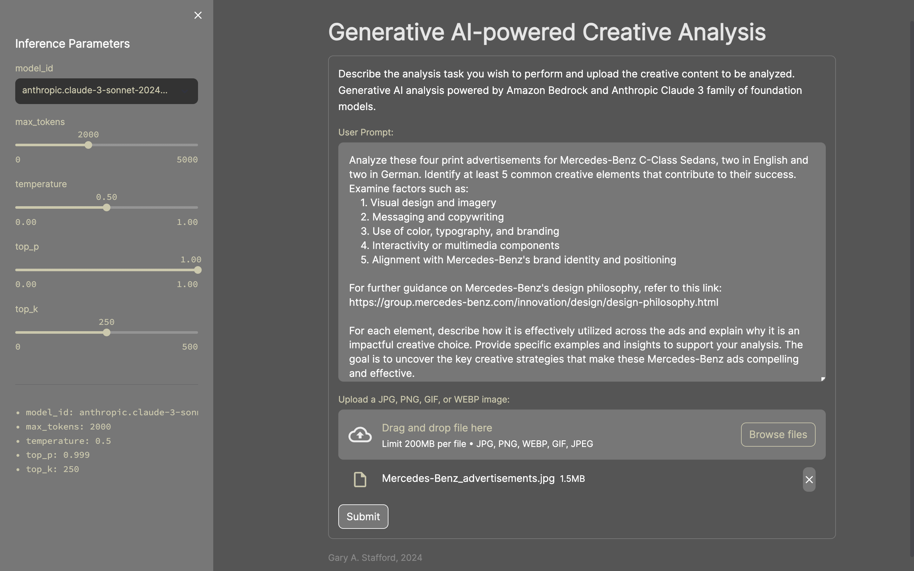
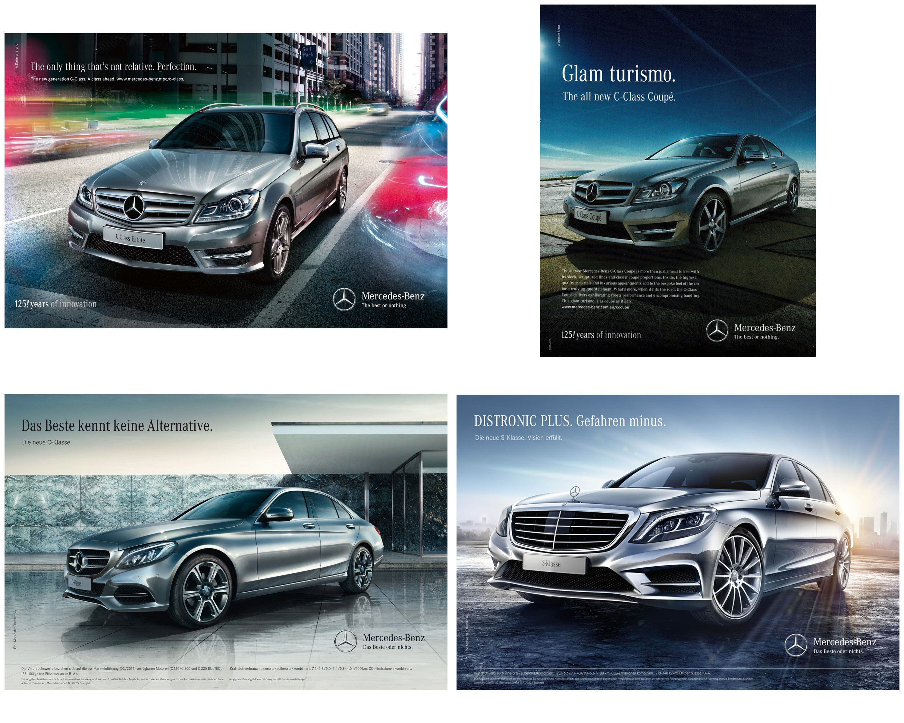

# Generative AI-powered Creative Analysis

Simple Streamlit application used for demonstrating Anthropic Claude 3 family of model's multimodal prompting on Amazon Bedrock. Oriented toward AdTech, MarTech, Advertising Agencies. Describe the analysis task you wish to perform and upload the creative content to be analyzed. Analysis powered by Amazon Bedrock and Anthropic Claude 3 foundational AI model.



## Samples Advertisements



## Start Application

```sh
python3 -m pip install virtualenv -Uq
virtualenv claude-streamlit-venv
python3 -m venv claude-streamlit-venv

source claude-streamlit-venv/bin/activate

python3 -m pip install -r requirements.txt -Uq

streamlit run app.py \
    --server.runOnSave true \
    --theme.base "light" \
    --theme.backgroundColor "#333333" \
    --theme.primaryColor "#CCC8AA" \
    --theme.secondaryBackgroundColor "#777777" \
    --ui.hideTopBar "true" \
    --client.toolbarMode "minimal"
```


## Samples Prompts

### Using a well-engineered Prompt for Analysis

Prompt optimized by model in advance. No external source of knowledge used.

```text
Analyze these four print advertisements for Mercedes-Benz sedans, two in English and two in German. Identify at least 5 common creative elements that contribute to their success. Examine factors such as:
    1. Visual design and imagery
    2. Messaging and copywriting
    3. Use of color, typography, and branding
    4. Interactivity or multimedia components
    5. Alignment with Mercedes-Benz's brand identity and positioning

For each element, describe how it is effectively utilized across the ads and explain why it is an impactful creative choice. Provide specific examples and insights to support your analysis. The goal is to uncover the key creative strategies that make these Mercedes-Benz ads compelling and effective.
```

### Referring to an External Source of Information

Using the Mercedes-Benz "Our design philosophy." website content as a basis of the analysis.

```text
Analyze these four successful print advertisements for Mercedes-Benz sedans, two in English and two in German. Identify common creative elements that contribute to their success. How well do the elements align to Mercedes-Benz's design philosophy found here:

https://group.mercedes-benz.com/innovation/design/design-philosophy.html
```

### Prompt Optimization Example

Have the model optimize the prompt.

```text
You are an expert at optimizing large language model positive prompts for marketing analysts. Your job is to create a concise and effective positive prompt that will provide effective responses from a large language model, given the following marketing analyst's task description, which will accompany the these advertising samples:

Analyze these advertisements and find some common creative elements. Some are in English and some are in German.
```

### Generate Creative Concepts from Creative Analysis

Using the analysis to design new advertising.

```text
Based on the following analysis of four successful Mercedes-Benz advertisements, describe a new and compelling design for a 'Large Leaderboard' size digital advertisement appearing on the 'Modern Luxury | Manhattan' website, for Mercedes-Benz C-Class Sedans, targeting young affluent urban couples between 25-35 years old. Use the 'Modern Luxury | Manhattan' online ad specs found here as a reference for the layout: https://mlmanhattan.com/online-ad-specs.

These Mercedes-Benz print advertisements showcase several compelling creative elements that contribute to their effectiveness in promoting the brand's luxury sedans:

1. Striking visual imagery: All four ads feature high-quality, dramatic photography that showcases the vehicles in stylish and aspirational settings. The use of dynamic lighting, motion blur effects, and urban/futuristic backdrops creates a sense of sophistication and excitement around the cars.

2. Impactful copywriting: The ads employ concise, evocative taglines and headlines that reinforce Mercedes-Benz's brand positioning around perfection, innovation, and superior performance. Examples include "The only thing that's not relative. Perfection." and "Glam turismo." The German copy like "Das Beste kennt keine Alternative" also conveys a premium, uncompromising message.

3. Consistent branding elements: The iconic Mercedes-Benz tri-star logo is prominently featured in each ad, along with the brand's signature typography and color palette of silver, black, and blue tones. This strong brand identity ties the campaigns together cohesively.

4. Focus on design and styling: The ads highlight the sleek, modern designs of the featured C-Class and S-Class models through artistic angles and attention to detail on elements like the sculpted bodies, alloy wheels, and LED lighting accents.

5. Aspirational lifestyle positioning: While showcasing the vehicles themselves, the ads also subtly convey an aspirational, luxurious lifestyle through the sophisticated urban settings, use of motion and speed, and overall premium aesthetic. This aligns with Mercedes-Benz's high-end brand identity.

Overall, these print ads leverage striking visuals, compelling copy, consistent branding, design-focused vehicle depictions, and an aspirational luxury positioning to create a cohesive, impactful campaign that effectively promotes Mercedes-Benz's premium sedan offerings.
```
