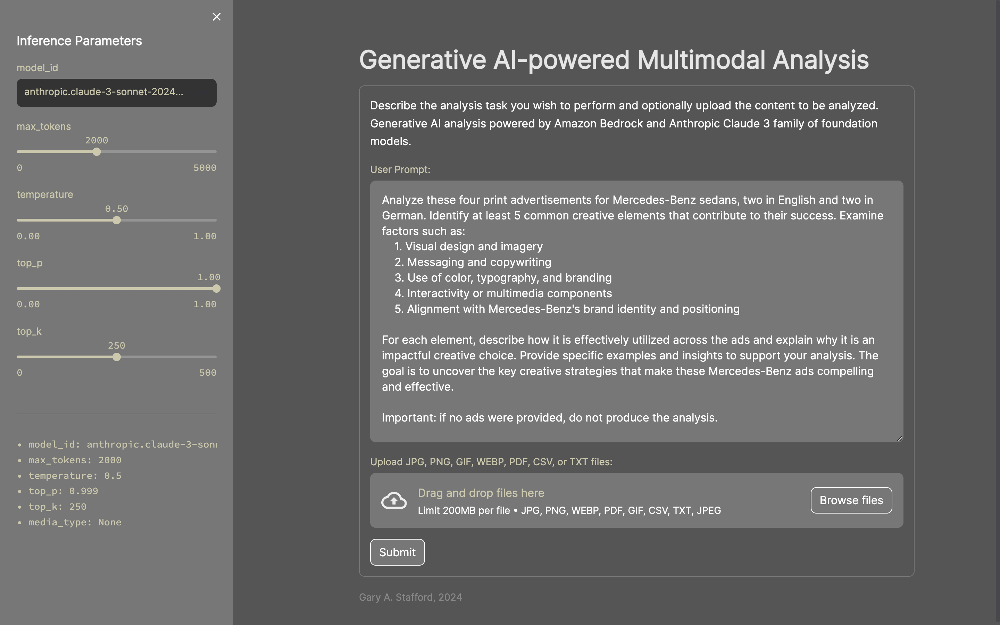

# Generative AI-powered Creative Analysis

Simple Streamlit [application](app.py) used for demonstrating [Anthropic Claude 3](https://www.anthropic.com/news/claude-3-family) family of model's multimodal prompting on [Amazon Bedrock](https://aws.amazon.com/bedrock). To start, describe the analysis task you wish to perform and optionally upload the content to be analyzed. The app currently supports uploading multiple JPG, PNG, GIF, WebP, PDF, CSV, or TXT files. The Analysis powered by Amazon Bedrock and Anthropic Claude 3 foundational AI model. The Streamlit application calls the [Anthropic Claude Messages API](https://docs.aws.amazon.com/bedrock/latest/userguide/model-parameters-anthropic-claude-messages.html); refer to this link for all inference parameters.



## Media Types Supported

Currently, this app supports the following media-types for uploading:

- image/jpeg - natively supported by Bedrock/Anthropic
- image/png - natively supported by Bedrock/Anthropic
- image/webp - natively supported by Bedrock/Anthropic
- image/gif - natively supported by Bedrock/Anthropic
- text/plain - content of file is added into prompt as raw text
- text/csv - content of file is added into prompt as raw text (a little hacky right now...)
- application/pdf - content of file is added into prompt as raw text (a little hacky right now...)

## Start Application

```sh
python3 -m pip install virtualenv -Uq
virtualenv claude-streamlit-venv
python3 -m venv claude-streamlit-venv

source claude-streamlit-venv/bin/activate

python3 -m pip install -r requirements.txt -Uq

streamlit run app.py \
    --server.runOnSave true \
    --theme.base "light" \
    --theme.backgroundColor "#333333" \
    --theme.primaryColor "#CCC8AA" \
    --theme.secondaryBackgroundColor "#777777" \
    --ui.hideTopBar "true" \
    --client.toolbarMode "minimal"
```

## Samples Advertisements

<table>
    <tr>
        <td width=384><image src="mercedes_benz_ads/ad1.jpeg"></td>
        <td width=384><image src="mercedes_benz_ads/ad2.jpeg"></td>
    </tr>
    <tr>
        <td width=384><image src="mercedes_benz_ads/ad3.jpeg"></td>
        <td width=384><image src="mercedes_benz_ads/ad4.jpeg"></td>
    </tr>
</table>

## Samples Prompts

### 1. Analysis of Four Print Advertisements for Mercedes-Benz

Provides an analysis of the four uploaded print advertisements for Mercedes-Benz.

Upload (4) JPEGs:

- [mercedes_benz_ads/ad1.jpeg](mercedes_benz_ads/ad1.jpeg)
- [mercedes_benz_ads/ad2.jpeg](mercedes_benz_ads/ad2.jpeg)
- [mercedes_benz_ads/ad3.jpeg](mercedes_benz_ads/ad3.jpeg)
- [mercedes_benz_ads/ad4.jpeg](mercedes_benz_ads/ad4.jpeg),

Prompt:

```text
Analyze these four print advertisements for Mercedes-Benz sedans, two in English and two in German. Identify at least 5 common creative elements that contribute to their success. Examine factors such as:
    1. Visual design and imagery
    2. Messaging and copywriting
    3. Use of color, typography, and branding
    4. Interactivity or multimedia components
    5. Alignment with Mercedes-Benz's brand identity and positioning

For each element, describe how it is effectively utilized across the ads and explain why it is an impactful creative choice. Provide specific examples and insights to support your analysis. The goal is to uncover the key creative strategies that make these Mercedes-Benz ads compelling and effective.

Important: if no ads were provided, do not produce the analysis.
```

### 2. Prompt Optimization

Asking the foundation model to optimize the user's initial prompt based on the task and content.

Upload (4) JPEGs:

- [mercedes_benz_ads/ad1.jpeg](mercedes_benz_ads/ad1.jpeg)
- [mercedes_benz_ads/ad2.jpeg](mercedes_benz_ads/ad2.jpeg)
- [mercedes_benz_ads/ad3.jpeg](mercedes_benz_ads/ad3.jpeg)
- [mercedes_benz_ads/ad4.jpeg](mercedes_benz_ads/ad4.jpeg),

Prompt:

```text
You are an expert at optimizing large language model prompts for marketing analysts. Your job is to create a concise and effective positive prompt that will provide effective responses from a large language model, given the following marketing analyst's task description and the accompany advertising samples:

Analyze these print advertisements and find some common creative elements. Some ads are in English and some are in German.
```

### 3. Generate New Creative Concepts from Analysis of Four Print Advertisements for Mercedes-Benz

Using the resulting analysis to design for new 'Large Leaderboard' size digital advertisement appearing on the 'Modern Luxury | Manhattan' website, for Mercedes-Benz C-Class Sedans, targeting young affluent urban couples between 25-35 years old.

Upload (2) PDFs:

- [manhattan_ad_specs/Ad_Specs_Modern_Luxury.pdf](manhattan_ad_specs/Ad_Specs_Modern_Luxury.pdf)
- [manhattan_ad_specs/Advertise_Info_Modern_Luxury.pdf](manhattan_ad_specs/Advertise_Info_Modern_Luxury.pdf)

Prompt:

```text
Based on the following analysis of four successful Mercedes-Benz print advertisements, describe a new and compelling design for a 'Large Leaderboard' size digital advertisement appearing on the 'Modern Luxury | Manhattan' website, for Mercedes-Benz C-Class Sedans, targeting young affluent urban couples between 25-35 years old. Use the 'Modern Luxury | Manhattan' online ad specs as a reference for the layout, described in this PDF. Include the size of the ad in the response.

These Mercedes-Benz print advertisements showcase several compelling creative elements that contribute to their effectiveness in promoting the brand's luxury sedans:

1. Striking visual imagery: All four ads feature high-quality, dramatic photography that showcases the vehicles in stylish and aspirational settings. The use of dynamic lighting, motion blur effects, and urban/futuristic backdrops creates a sense of sophistication and excitement around the cars.

2. Impactful copywriting: The ads employ concise, evocative taglines and headlines that reinforce Mercedes-Benz's brand positioning around perfection, innovation, and superior performance. Examples include "The only thing that's not relative. Perfection." and "Glam turismo." The German copy like "Das Beste kennt keine Alternative" also conveys a premium, uncompromising message.

3. Consistent branding elements: The iconic Mercedes-Benz tri-star logo is prominently featured in each ad, along with the brand's signature typography and color palette of silver, black, and blue tones. This strong brand identity ties the campaigns together cohesively.

4. Focus on design and styling: The ads highlight the sleek, modern designs of the featured C-Class and S-Class models through artistic angles and attention to detail on elements like the sculpted bodies, alloy wheels, and LED lighting accents.

5. Aspirational lifestyle positioning: While showcasing the vehicles themselves, the ads also subtly convey an aspirational, luxurious lifestyle through the sophisticated urban settings, use of motion and speed, and overall premium aesthetic. This aligns with Mercedes-Benz's high-end brand identity.

Overall, these print ads leverage striking visuals, compelling copy, consistent branding, design-focused vehicle depictions, and an aspirational luxury positioning to create a cohesive, impactful campaign that effectively promotes Mercedes-Benz's premium sedan offerings.
```

### 4. Example of Analyzing a Text File vs. Image

Upload (1) TXT file:

- [MB_info.txt](MB_info.txt)

Prompt:

```text
Provides a summary of this document.
```

### 5. Analyzing a PayPal Creative Brief and Generate New Creative Concepts

Analyze a creative brief for PayPal and generate three ideas for new ads. Output a structured response as well-formatted JSON that an be easily ingested into a downstream system.

Upload (1) WebP file:

- [/creative_briefs/paypal-creative-brief-1-2048.webp](/creative_briefs/paypal-creative-brief-1-2048.webp)

Prompt:

```text
You are a Creative Director for a leading advertising agency. Based on this following Creative Brief for PayPal, develop three compelling online digital advertisements. Include a unique ad id (UUID), headline, ad copy, call to action, and description of imagery for each in your response. Format the response as a series of JSON objects according to the template below.

{
    "advertisements": [
        {
            "id": "",
            "headline": "",
            "ad_copy": "",
            "call_to_action": "",
            "imagery": ""
        },
        {
            "id": "",
            "headline": "",
            "ad_copy": "",
            "call_to_action": "",
            "imagery": ""
        },
        {
            "id": "",
            "headline": "",
            "ad_copy": "",
            "call_to_action": "",
            "imagery": ""
        }
    ]
}
```

### 6a. Develop a Layout for an Ad Based on the Generated Creative Concepts Above (see #5)

No upload required.

Prompt:

```text
You are a talented Graphic Designer for a leading advertising agency. Based on the following headline, ad copy, call to action, and description of imagery for a compelling online digital advertisement, describe the layout in detail. The ad should designed in a tall, portrait-format, with a height-to-width ratio of 3:2.

{
  "advertisement": {
    "headline": "Your Money, Your Rules",
    "ad_copy": "As a teen, you're starting to gain independence and make your own choices. With PayPal, you have complete control over your money. Whether it's receiving allowance from your parents or getting paid for that dog-walking gig, PayPal is your virtual wallet that lets you manage your funds on your terms. No more waiting for your parents to hand you cash or dealing with the complexities of credit cards.",
    "call_to_action": "Download the PayPal app today and take charge of your financial freedom.",
    "imagery": "The ad features a group of diverse teens hanging out together, laughing and having fun. One of them holds up their smartphone, displaying the PayPal app. The imagery conveys a sense of independence, friendship, and the freedom to manage their money on their own terms."
  }
}
```

### 6b. Develop a Layout for an Ad Based on the Generated Creative Concepts Above (see #5) using the Creative Brief as Additional Context

Upload (1) WebP file:

- [/creative_briefs/paypal-creative-brief-1-2048.webp](/creative_briefs/paypal-creative-brief-1-2048.webp)

Prompt:

```text
You are a talented Graphic Designer for a leading advertising agency. Based on the following headline, ad copy, call to action, and description of imagery for a compelling online digital advertisement, describe the layout in detail. The ad should designed in a tall, portrait-format, with a height-to-width ratio of 3:2. The Creative Brief for PayPal is included for reference.

{
  "advertisement": {
    "headline": "Your Money, Your Rules",
    "ad_copy": "As a teen, you're starting to gain independence and make your own choices. With PayPal, you have complete control over your money. Whether it's receiving allowance from your parents or getting paid for that dog-walking gig, PayPal is your virtual wallet that lets you manage your funds on your terms. No more waiting for your parents to hand you cash or dealing with the complexities of credit cards.",
    "call_to_action": "Download the PayPal app today and take charge of your financial freedom.",
    "imagery": "The ad features a group of diverse teens hanging out together, laughing and having fun. One of them holds up their smartphone, displaying the PayPal app. The imagery conveys a sense of independence, friendship, and the freedom to manage their money on their own terms."
  }
}
```

## Example Response from Foundation Model

Example response body from Claude 3 Sonnet model on Bedrock. Note that responses also include input and output token counts, which are useful for estimating costs.

```json
{
  "id": "msg_017ntpirxuSGXfJMN1afGAXR",
  "type": "message",
  "role": "assistant",
  "content": [
    {
      "type": "text",
      "text": "Here is a concise and effective positive prompt for analyzing the common creative elements across these Mercedes-Benz print advertisements, some in English and some in German:\n\n\"Examine the visual design, messaging, and marketing approaches used across these Mercedes-Benz vehicle print ads. Identify recurring creative strategies, themes, and techniques employed to promote the brand's luxury automotive offerings to potential customers. Discuss how the ads aim to create desire and appeal through their imagery, copy, and overall artistic execution, while being mindful to objectively analyze the marketing without subjective judgement or bias.\""
    }
  ],
  "model": "claude-3-sonnet-28k-20240229",
  "stop_reason": "end_turn",
  "stop_sequence": null,
  "usage": {
    "input_tokens": 1662,
    "output_tokens": 124
  }
}
```

```json
{
  "id": "msg_01A6TxmM18XGTFJ6vMk7xnCg",
  "type": "message",
  "role": "assistant",
  "content": [
    {
      "type": "text",
      "text": "These Mercedes-Benz print advertisements showcase several compelling creative elements that contribute to their effectiveness in promoting the brand's luxury sedans:\n\n1. Striking visual imagery: All four ads feature high-quality, dramatic photography that showcases the vehicles in stylish and aspirational settings. The use of dynamic lighting, motion blur effects, and urban/futuristic backdrops creates a sense of sophistication and excitement around the cars.\n\n2. Impactful copywriting: The ads employ concise, evocative taglines and headlines that reinforce Mercedes-Benz's brand positioning around perfection, innovation, and superior performance. Examples include \"The only thing that's not relative. Perfection.\" and \"Glam turismo.\" The German copy like \"Das Beste kennt keine Alternative\" also conveys a premium, uncompromising message.\n\n3. Consistent branding elements: The iconic Mercedes-Benz tri-star logo is prominently featured in each ad, along with the brand's signature typography and color palette of silver, black, and blue tones. This strong brand identity ties the campaigns together cohesively.\n\n4. Focus on design and styling: The ads highlight the sleek, modern designs of the featured C-Class and S-Class models through artistic angles and attention to detail on elements like the sculpted bodies, alloy wheels, and LED lighting accents.\n\n5. Aspirational lifestyle positioning: While showcasing the vehicles themselves, the ads also subtly convey an aspirational, luxurious lifestyle through the sophisticated urban settings, use of motion and speed, and overall premium aesthetic. This aligns with Mercedes-Benz's high-end brand identity.\n\nOverall, these print ads leverage striking visuals, compelling copy, consistent branding, design-focused vehicle depictions, and an aspirational luxury positioning to create a cohesive, impactful campaign that effectively promotes Mercedes-Benz's premium sedan offerings."
    }
  ],
  "model": "claude-3-sonnet-28k-20240229",
  "stop_reason": "end_turn",
  "stop_sequence": null,
  "usage": {
    "input_tokens": 1743,
    "output_tokens": 417
  }
}
```

---

_The contents of this repository represent my viewpoints and not of my past or current employers, including Amazon Web Services (AWS). All third-party libraries, modules, plugins, and SDKs are the property of their respective owners._
