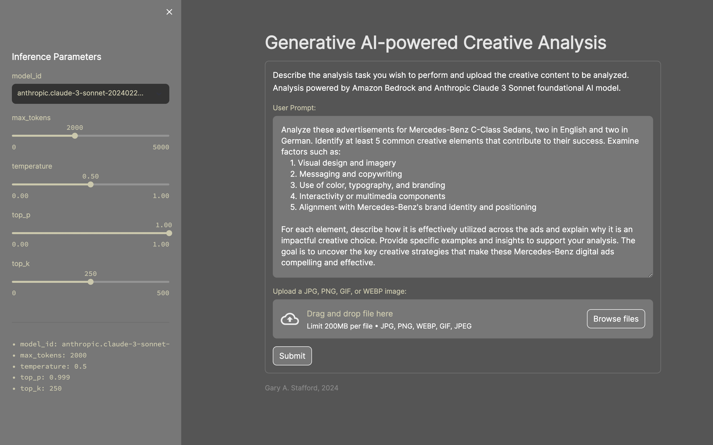

# Generative AI-powered Creative Analysis

Simple Streamlit application used for demonstrating Anthropic Claude 3 Sonnet multimodal prompting on Amazon Bedrock. Describe the analysis task you wish to perform and upload the creative content to be analyzed. Analysis powered by Amazon Bedrock and Anthropic Claude 3 Sonnet foundational AI model.



## Samples Advertisements


## Start Application

```sh
python3 -m pip install virtualenv -Uq
virtualenv claude-streamlit-venv
python3 -m venv claude-streamlit-venv

source claude-streamlit-venv/bin/activate

python3 -m pip install -r requirements.txt -Uq

streamlit run app.py \
    --server.runOnSave true \
    --theme.base "light" \
    --theme.backgroundColor "#333333" \
    --theme.primaryColor "#CCC8AA" \
    --theme.secondaryBackgroundColor "#777777" \
    --ui.hideTopBar "true" \
    --client.toolbarMode "minimal"
```


## Samples Prompts

### Well-engineered Prompt

```text
Analyze these advertisements for Mercedes-Benz C-Class Sedans, two in English and two in German. Identify at least 5 common creative elements that contribute to their success. Examine factors such as:
    1. Visual design and imagery
    2. Messaging and copywriting
    3. Use of color, typography, and branding
    4. Interactivity or multimedia components
    5. Alignment with Mercedes-Benz's brand identity and positioning

For each element, describe how it is effectively utilized across the ads and explain why it is an impactful creative choice. Provide specific examples and insights to support your analysis. The goal is to uncover the key creative strategies that make these Mercedes-Benz digital ads compelling and effective.
```

### Prompt Optimization Example

```text
You are an expert at optimizing large language model positive prompts for marketing analysts. Your job is to create a concise and effective positive prompt that will provide effective responses from a large language model, given the following marketing analyst's task description, which will accompany the these advertising samples:

Analyze these advertisements and find some common creative elements. Some are in English and some are in German.
```

### Generate Creative Concepts from Creative Analysis

```text
Based on the following analysis of four successful Mercedes-Benz advertisements, describe a new and compelling design for a digital advertisement targeting young affluent urban couples from 25-35 years old:

These Mercedes-Benz C-Class Sedan advertisements showcase several creative elements that contribute to their effectiveness and alignment with the brand's identity:

1. Striking visual imagery: The ads feature high-quality, dramatic photography that showcases the vehicles in dynamic, aspirational settings. The use of motion blur, lighting effects, and urban/scenic backdrops creates a sense of excitement and sophistication, aligning with Mercedes-Benz's positioning as a premium luxury brand.

2. Impactful copywriting: The headlines and taglines are concise yet powerful, conveying key brand messages. Examples include "The only thing that's not relative. Perfection." and "Glam turismo." The German ads use phrases like "Das Beste kennt keine Alternative" (The best knows no alternative) and "DISTRONIC PLUS. Gefahren minus" (DISTRONIC PLUS. Driven minus), highlighting the brand's focus on innovation and technology.

3. Consistent branding and typography: The iconic Mercedes-Benz logo and brand name are prominently displayed, reinforcing brand recognition. The typography choices, including the distinctive Mercedes-Benz font, contribute to a cohesive and visually striking aesthetic across the ads.

4. Effective use of color: The ads skillfully employ a combination of bold, attention-grabbing colors (like the vibrant red and blue light trails) and sleek, sophisticated tones (like the silver and gray hues of the vehicles). This color palette aligns with Mercedes-Benz's brand identity, conveying both luxury and modernity.

5. Emphasis on innovation and technology: Several ads highlight advanced features like "DISTRONIC PLUS," positioning Mercedes-Benz as a leader in automotive innovation. This messaging reinforces the brand's commitment to engineering excellence and cutting-edge technology, which is a key selling point for their target audience.

Overall, these Mercedes-Benz C-Class Sedan advertisements effectively leverage compelling visuals, persuasive copywriting, consistent branding, strategic color choices, and a focus on innovation to create a cohesive and impactful campaign that aligns with the brand's positioning as a premium luxury automaker known for its engineering prowess and sophisticated design.
```
